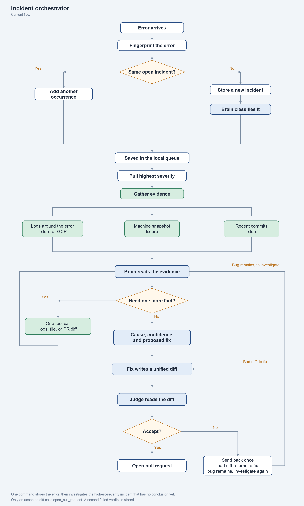
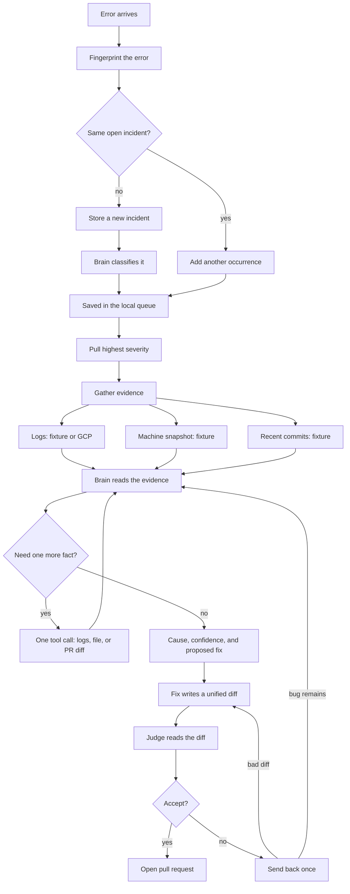
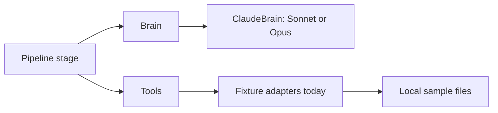

# Orchestrator so far

An incoming production error is stored and classified. One command then pulls the highest-severity incident that still has no conclusion, gathers evidence once, and lets the brain investigate it. The brain may request one more tool before it stops with a root cause, a confidence, and a proposed fix. Tools currently return local sample data.

The sample error is a fictional `video-indexer` crash. Nothing connects to that service or to a machine.

## What runs today

The fingerprint is a hash of the service, the normalized message, and the top stack frames. Two reports of the same crash stay one incident. Classification chooses a category, a severity, the likely component, and a short reason. Severity orders the queue. The command then pulls the highest-severity incident that has no conclusion yet. That may be an older incident, not the error that just arrived.

Evidence for the pulled incident is logs from the window in `config/pipeline.toml` (one minute on each side by default), the telemetry snapshot for that machine id, and recent commits for the mapped repository. The brain reads that packet. If one fact is still missing, it requests one tool call and reads the result. It then stops with a root cause, a confidence, and a proposed fix. The command processes one incident and stops.

## Where each piece lives

A stage never calls a vendor API on its own. `Brain` is the only model boundary. Classification and investigation can use different models. `Tools` is the only way to read logs, telemetry, or git, including the extra call inside the investigation loop. Replacing the fixture files with GCP logs or GitHub means a new adapter behind the same three functions.

| Tool | Asks for | Sample result |
|---|---|---|
| `get_logs` | Lines around the error | RTSP connection lost, then the crash |
| `get_machine_state` | Snapshot for the machine id | Version `video-indexer-1.8.3`, normal CPU and memory |
| `get_recent_changes` | Commits for the service repo | `abc123` moved `StreamContext` into the reconnect callback |

## What is next

The command stops after one pulled incident. Still ahead: whether that pull should repeat until the queue is empty, and the Markdown report.
